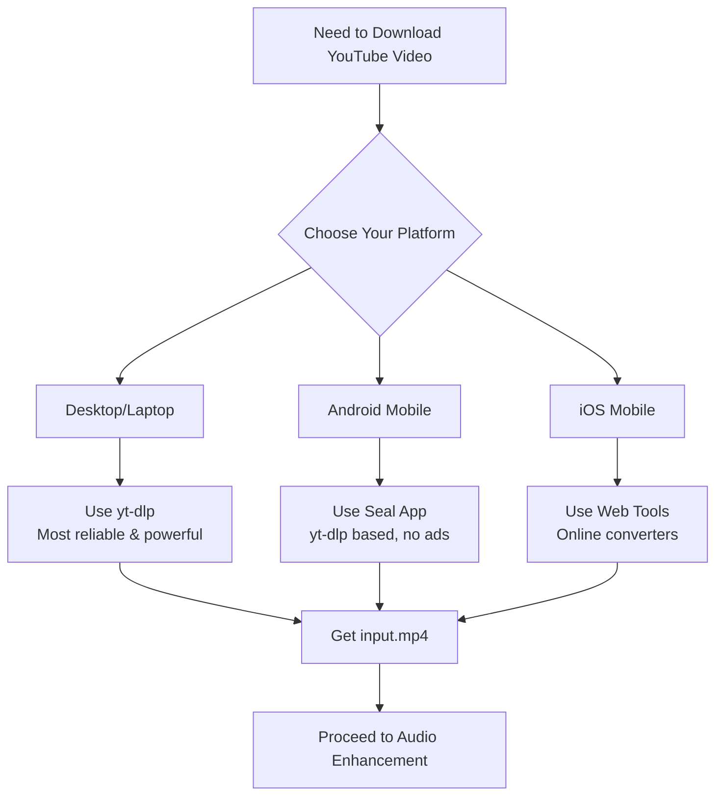

Sometimes the audio in YouTube videos is too quite, take [Help Bob Belong](https://youtu.be/6kGpk8-baMM?si=pvU2DPDne79zvmpa) for example. This guide shows you how to download YouTube videos and properly amplify their audio using free, open-source tools.

### Download the YouTube Video

**Prerequisites:**

- Linux system (or WSL2 on Windows)
- Terminal access
- Basic command-line familiarity

**Steps:**

1. Install `yt-dlp` and download the video



# Install yt-dlp

sudo apt update
sudo apt install yt-dlp

# Download a video (best quality MP4)

yt-dlp -f "bestvideo[ext=mp4]+bestaudio[ext=m4a]/best[ext=mp4]" "YOUTUBE_URL" -o input.mp4

# Download just audio (MP3)

yt-dlp -x --audio-format mp3 "YOUTUBE_URL" -o "audio.%(ext)s"


2. For Android users who prefer a mobile solution:

- **App:** Seal Video/Audio Downloader
- **Developer:** JunkFood02
- **Source:** [GitHub Repository](https://github.com/JunkFood02/Seal)
- **Features:**
  - Based on yt-dlp engine
  - Material You design
  - No ads, completely free
  - Batch downloads
  - Format selection (video/audio only)
  - SponsorBlock integration

**Installation:** Available on [F-Droid](https://f-droid.org/packages/com.junkfood.seal/) or download APK from GitHub releases.

### 2: Amplify Audio with FFmpeg

**Install FFmpeg if needed:**


   sudo apt install ffmpeg   


**A: Simple Volume Boost**



# Mild boost (safe, no distortion)

ffmpeg -i input.mp4 -filter:a "volume=5dB" -c:v copy output_mild.mp4

# Strong boost

ffmpeg -i input.mp4 -filter:a "volume=15dB" -c:v copy output_strong.mp4



> Note: `-c:v copy` copies video without re-encoding (faster)

**B: Loudness Normalization (Recommended)**



# Simple normalization

ffmpeg -i input.mp4 -af loudnorm output.mp4

# Advanced normalization with dynamic range compression

ffmpeg -i input.mp4 -af "loudnorm=I=-16:LRA=11:TP=-1.5" -c:v copy output_normalized.mp4



**Parameters explained:**

- `I=-16`: Target loudness (-16 LUFS for web, -24 for broadcast)
- `LRA=11`: Loudness range (preserves dynamics)
- `TP=-1.5`: True peak limit (prevents clipping)

**C: Dynamic Range Compression**


   ffmpeg -i input.mp4 -af "compand=attacks=0:points=-80/-80|-30/-10|0/0" -c:v copy output_compressed.mp4   


### 3. One-Liner Download and Boost



yt-dlp -f "best[ext=mp4]" "YOUTUBE_URL" -o - | \
ffmpeg -i pipe: -af "loudnorm=I=-16:LRA=11" -c:v copy output_enhanced.mp4



### Share Your Enhanced Video

Once you have `output.mp4`:

1. **Mobile Messaging:** WhatsApp, Telegram, Signal
2. **Cloud Storage:** Google Drive, Dropbox, OneDrive
3. **Social Media:** Instagram, Twitter, Facebook
4. **Email:** Most clients support MP4 attachments

## Important Notes

- **Legal:** Only download content you have rights to or is in the public domain
- **Quality:** Loudness normalization may cause slight quality loss
- **Backup:** Always keep original files before processing
- **Copyright:** Respect content creators' rights

## Troubleshooting

**Problem:** Audio sounds distorted
**Solution:** Reduce boost amount or use loudnorm instead of volume filter

**Problem:** FFmpeg process is slow
**Solution:** Use `-c:v copy` to avoid video re-encoding

**Problem:** yt-dlp doesn't work with some videos
**Solution:** Update yt-dlp: `sudo yt-dlp -U`

## Additional Resources

- [FFmpeg Audio Filters Documentation](https://ffmpeg.org/ffmpeg-filters.html#Audio-Filters)
- [yt-dlp GitHub](https://github.com/yt-dlp/yt-dlp)
- [EBU R128 Loudness Standard](https://tech.ebu.ch/loudness)
- [Seal App Documentation](https://github.com/JunkFood02/Seal/wiki)

---

**Final Recommendation:** For most users, `ffmpeg -i input.mp4 -af "loudnorm=I=-16:LRA=11" -c:v copy output.mp4` provides the best balance of quality and compatibility.
