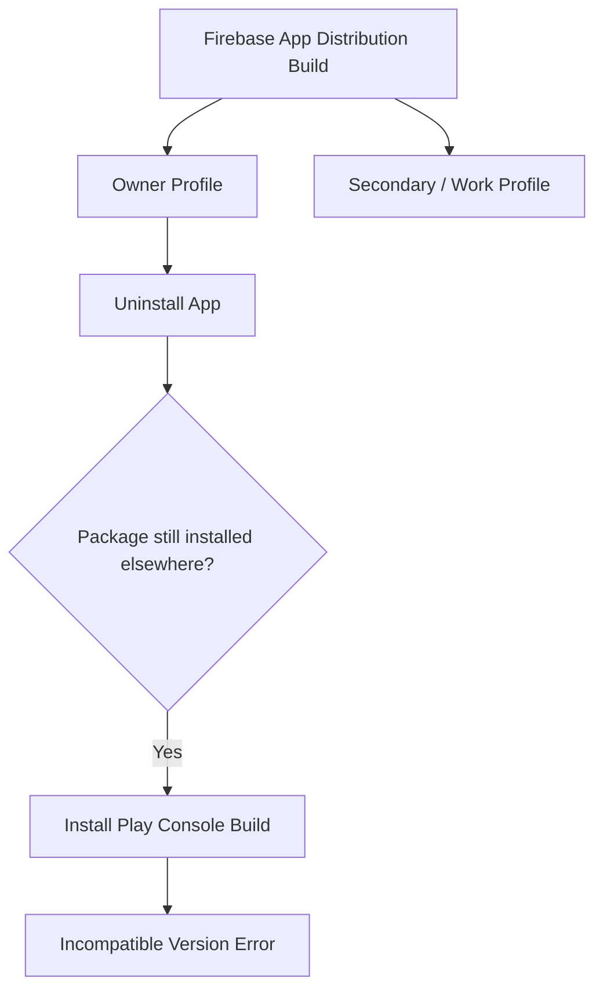

---

layout: post
title: "Fixing Android's 'Incompatible Version Already Installed' Error"
date: 2026-07-13 02:15:00
description: "How to fix Android installation conflicts when switching between Firebase App Distribution and Google Play Console."
tags: [android, debugging]
categories: [technology]
tabs: true
mermaid:
enabled: true
zoomable: true
--------------

When testing an Android app across different distribution channels, such as moving from **Firebase App Distribution** to the **Google Play Console**, you may encounter this error:

> *"Another user has already installed an incompatible version of this app on this device."*

This can be particularly common on devices with **secondary users, work profiles, or other isolated profiles**.

### Why it happens

Uninstalling an app from your primary profile does not necessarily remove the package from the entire device. If the app is still installed or available to another user profile, Android's package manager can continue to treat it as installed.

This becomes a problem when the new APK has a different **signing key** or an incompatible **version code**.

The basic conflict looks like this:



### Fix

The simplest solution is to remove the application from the other profiles on the device.

**1. Check your other profiles**

Go to:

**Settings → System → Multiple Users**

Depending on the device, you may also be able to switch profiles from the Quick Settings panel.

Check any secondary users, Guest profiles, or work profiles.

**2. Find the application**

In the secondary profile, open:

**Settings → Apps → See all apps**

Search for your application. It may still be listed even though you removed it from the primary profile.

**3. Remove it for all users**

Open the application's **App Info** screen.

From the three-dot menu, select:

**Uninstall for all users**

The exact wording can vary depending on the Android version and device manufacturer.

**4. Try the installation again**

Return to your primary profile and install the build from Google Play Console again.

### If it still doesn't work

You can use ADB to remove the package:

```bash
adb uninstall <your.package.name>
```

You can also check which users Android knows about:

```bash
adb shell pm list users
```

And check whether the package is still installed for a particular user:

```bash
adb shell pm list packages --user <user_id> | grep <your.package.name>
```

### Preventing the problem

A few practices can make switching between distribution channels less painful:

* **Use the same signing key** where possible. Firebase and Play-distributed builds should use compatible signing credentials.
* **Keep version codes increasing.** Android generally prevents installing an older version over a newer one.
* **Clean up unused profiles.** Guest and secondary profiles can retain applications that are no longer visible from the owner profile.
* **Use separate application IDs for development builds** when you regularly need multiple variants installed at the same time.

For example:

```text
com.example.app
com.example.app.dev
```

This avoids package-level conflicts altogether when testing different builds.

### Takeaway

If Android says another user has already installed an incompatible version, don't assume the application is completely uninstalled.

**Check the other profiles first.** The package may still exist there even though it has disappeared from your primary profile.
