```mermaid
graph TD
    Start[🌠 Game Start] --> Intro[🏡 Intro Scene<br/>Stella at Home]
    Intro --> Decision[🎮 Player Begins Journey]

    Decision --> MiniGame1[🎯 Mini-game 1<br/>Fog-Teller's Memory]
    Decision --> MiniGame2[🎶 Mini-game 2<br/>Wind Listener]
    Decision --> MiniGame3[🔔 Mini-game 3<br/>Silent Temple]

    MiniGame1 --> Region1[🏴󠁧󠁢󠁳󠁣󠁴󠁿 Scottish Highlands<br/>✅ Complete]
    MiniGame2 --> Region2[🇲🇳 Mongolian Steppe<br/>🔄 In Progress]
    MiniGame3 --> Region3[🇯🇵 Japanese Mountains<br/>🔄 In Progress]

    Region1 --> Gameplay1[🎮 Line Tracing Puzzle<br/>Connect constellations]
    Region2 --> Gameplay2[🎶 Rhythm Timing Game<br/>Catch wind notes]
    Region3 --> Gameplay3[🎵 Memory Sequence<br/>Match tone patterns]

    Gameplay1 --> Theme1[🧠 Theme: Memory & Vision]
    Gameplay2 --> Theme2[💨 Theme: Connection & Voice]
    Gameplay3 --> Theme3[🌸 Theme: Reflection & Renewal]

    Theme1 --> Stars1[⭐ Restore Constellation 1]
    Theme2 --> Stars2[⭐ Restore Constellation 2]
    Theme3 --> Stars3[⭐ Restore Constellation 3]

    Stars1 --> End[🌟 All Stars Restored]
    Stars2 --> End
    Stars3 --> End

    End --> Outro[🌌 Outro Scene<br/>Stella Returns Home]
    Outro --> Conclusion[✨ Stella's Transformation<br/>She sees the sky differently]
```

## Stella and the Threads of Dawn 🌟

**Stella and the Threads of Dawn** was part of the **GameUp Africa 2025** project submission.

### Development Status

- ✅ **Mini-game 1: The Fog-Teller's Memory** - **Complete**
- 🔄 **Mini-game 2: The Wind Listener** - Work in Progress
- 🔄 **Mini-game 3: The Silent Temple** - Work in Progress

### Core Narrative Premise

Following her first adventure in _Stella and the Missing Star_, Stella discovers that though the missing star has been restored, the night sky itself is unraveling. The constellations are losing their shapes, dimming as if their light is being forgotten. Her grandmother tells her that the stars are held in place by invisible "threads of dawn" - woven from the stories and memories people tell about them. When stories are forgotten, those threads begin to fray.

Determined to mend the sky, Stella embarks on another journey across three distant lands - each representing a place where stories and memory are fading. Guided by curiosity and compassion, she helps local guardians remember their ancient tales, reweaving the threads that hold the stars together.

### Characters

- **Stella**: The returning protagonist, a curious and brave young girl who embodies gratitude, imagination, and hope. Her role is both explorer and listener.
- **The Fog-Teller**: A gentle guardian in the Scottish Highlands who has forgotten the patterns of her people's sky myths.
- **The Wind Listener**: A Mongolian herder who listens to the voices of the wind but can no longer hear the song of his ancestors.
- **The Temple Keeper**: An elderly monk in the Japanese mountains who has fallen silent, forgetting the songs once sung to the stars.

### Setting & Art Direction

**Style**: Minimalist, painterly pixel art with soft palettes and smooth animations.

**Regional Settings**:

1. **Scottish Highlands**: Misty glens and stone circles with pale greens, foggy greys, and cool blues
2. **Mongolian Steppe**: Vast, open landscapes with warm golds, pink horizons, and teal skies
3. **Japanese Mountains**: Quiet mountain temples with desaturated whites and gentle pinks under moonlight

### Gameplay Overview

Each mini-game represents a cultural metaphor for remembering - focusing on timing, pattern recognition, and gentle interaction.

#### ✅ **Mini-game 1: The Fog-Teller's Memory (Scotland)** - **COMPLETE**

- **Mechanic**: Line tracing puzzle - connect glowing stones in the mist to reform constellation shapes
- **Goal**: Reconnect the stars by tracing glowing lines between standing stones before the fog rolls back in
- **Difficulty**: Light - no fail state, only slower progression if fog thickens
- **Status**: ✅ Fully implemented and playable

#### 🔄 **Mini-game 2: The Wind Listener (Mongolia)** - **IN PROGRESS**

- **Mechanic**: Rhythmic timing / catching game - catch floating wind-notes drifting by
- **Goal**: Catch drifting wind-notes before they vanish to restore the constellation's tune
- **Difficulty**: Moderate - slightly faster timing sequences appear as wind strengthens
- **Status**: 🔄 Currently in development

#### 🔄 **Mini-game 3: The Silent Temple (Japan)** - **IN PROGRESS**

- **Mechanic**: Memory sequence game - repeat 3–5 note patterns using temple bells
- **Goal**: Match tone sequences to restore the lost melody of the stars
- **Difficulty**: Slight increase with each round, but still meditative
- **Status**: 🔄 Currently in development

### Sound & Music

**Sound Design**: Subtle and natural - footsteps in grass, rustling wind, distant animal calls, crackling fire.

**Music**: No continuous background track. Short tonal motifs or ambient notes surface in response to player actions.

**Regional Sound Motifs**:

- **Fog-Teller's Valley**: Low whistles of wind and dripping mist
- **Wind Listener's Steppe**: Sparse flute notes and soft throat-singing drones
- **Silent Temple**: Resonant bells, plucked koto strings, and echoing silence

### Emotional Tone

Reflective, meditative, encouraging mindfulness and empathy rather than urgency or competition.

### Story Chapters

#### **Intro**

Stella sits on her windowsill, lantern beside her, noticing the constellations fading from both the sky and her notebook. Remembering her grandmother's words, she packs her things and follows the fading light into the unknown.

#### ✅ **Mini-game 1 - The Fog-Teller's Memory**

Stella wanders through thick fog in the Scottish Highlands, helping the Fog-Teller remember the patterns of celestial stories by tracing connections between standing stones. _This section is complete and fully playable._

#### 🔄 **Mini-game 2 - The Wind Listener**

On the Mongolian Steppe, Stella helps an old herder catch fragments of ancestral songs carried by the wind, restoring the sky's melody. _Currently in development._

#### 🔄 **Mini-game 3 - The Silent Temple**

At a quiet Japanese mountain temple, Stella helps the Temple Keeper remember forgotten songs by matching tone sequences, causing cherry blossoms to rise instead of fall. _Currently in development._

#### **Outro**

Back home, Stella looks up at the night sky with new understanding. The constellations haven't changed, but Stella has learned to see them differently - through the patterns, songs, and stories she helped restore.

### Development Team

- **Wendi Rakotondranaivo**
- **Akorede Dasilva**
- **Judah M**
- **Mirana Rakotonirina**

**Studio**: Ludus Studio

👉 **Try the game**: [Play Stella and the Threads of Dawn on itch.io](https://a-mih.itch.io/stella-and-the-tod)

_Note: Currently features the complete Scottish Highlands section with the Fog-Teller's Memory mini-game. Mongolian and Japanese sections are in active development._

---

### Gameplay Highlights

- 🌌 **Narrative-driven gameplay**: Each mini-game connects to cultural storytelling traditions
- 🎨 **Minimalist pixel art**: Painterly style with distinct regional color palettes
- 🎵 **Interactive sound design**: Music responds to player actions and progress
- 🧠 **Mindful mechanics**: Focus on contemplation, memory, and empathy over competition
- 🌍 **Cultural exploration**: Journey through Scottish, Mongolian, and Japanese-inspired settings
- 📊 **Development Progress**: First chapter complete, two more in development

---

    

        
    

    

        
    

    

        
    

    

        
    

    

        
    

