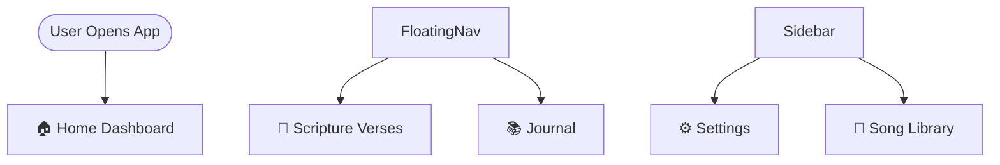
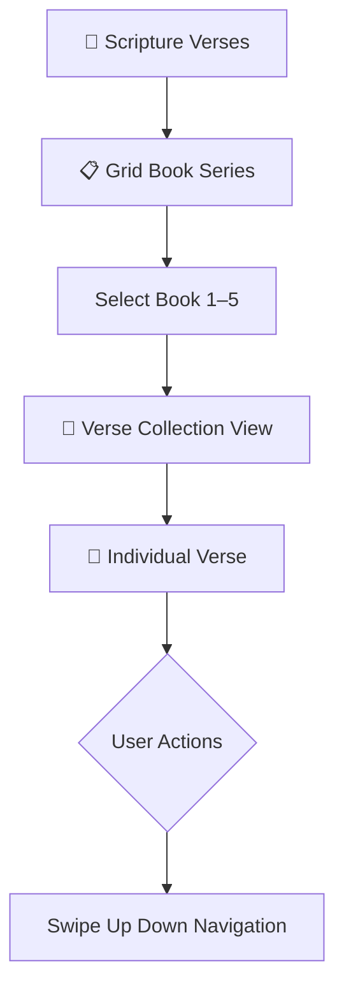
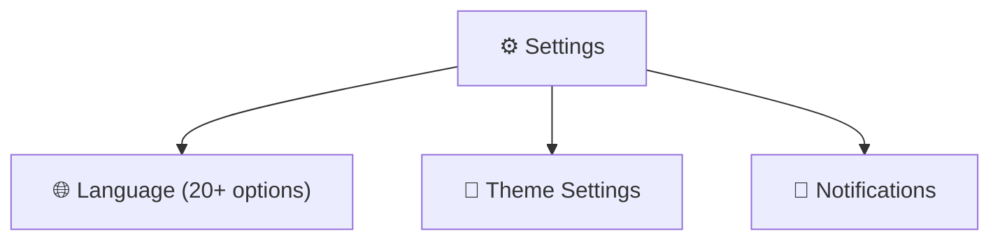
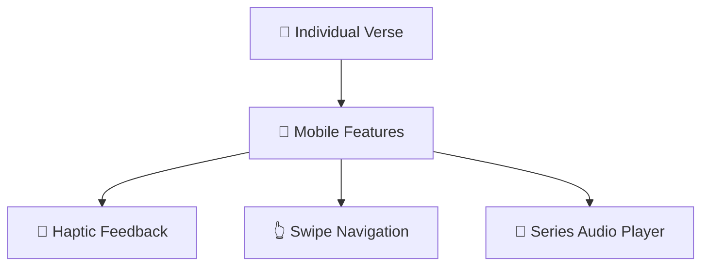

### TMS App Mobile

**Project Purpose:**  
The TMS App Mobile is designed to make memorization with mini games and study in the Topical Memorization Series (TMS)
easier, accessible, and portable. Whether you’re on **mobile, PC, or tablet**, the app ensures you can stay consistent
in your journey anytime and anywhere.

**Key Features:**

- Topical Memorization Series (A–E)
- Hymn Lyrics Catalog
- Plenary Guides & Illustrations
- GRID Series verses from the GRID books
- Multi-language support (Kenyan dialects + international)
- Optimized for **mobile-first use** with responsive design

**Link to Project(Private Beta):**
[Public Beta Testing](https://appdistribution.firebase.dev/i/5a3f2e3abd5b4c6b)

---

  

    
  

  

    
  

    

    
  

    

    
  

    

    
  

    

        
    

App Entry & Home Navigation

Verse Browsing & Interaction Flow

Settings & App Capabilities

Mobile Settings

