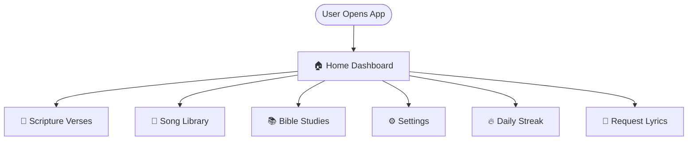
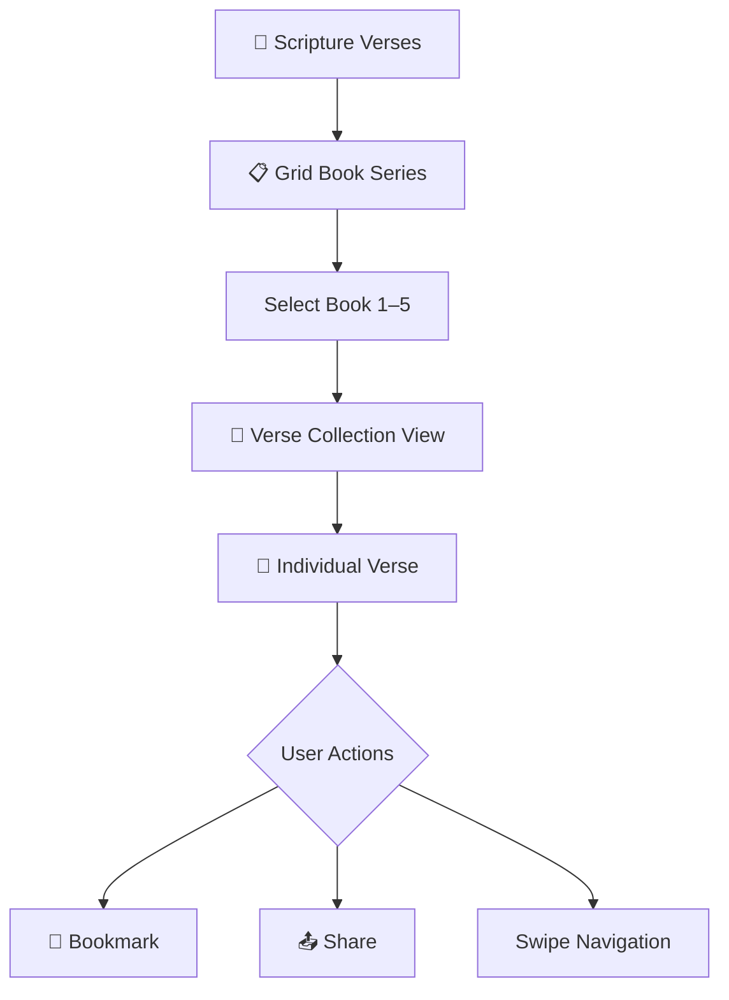
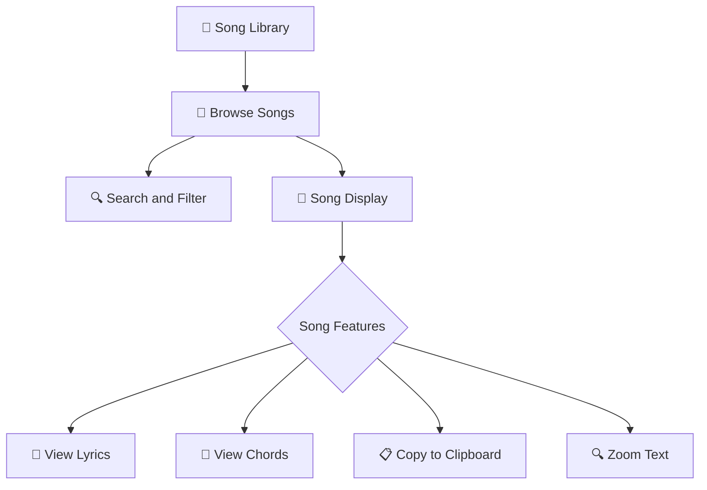
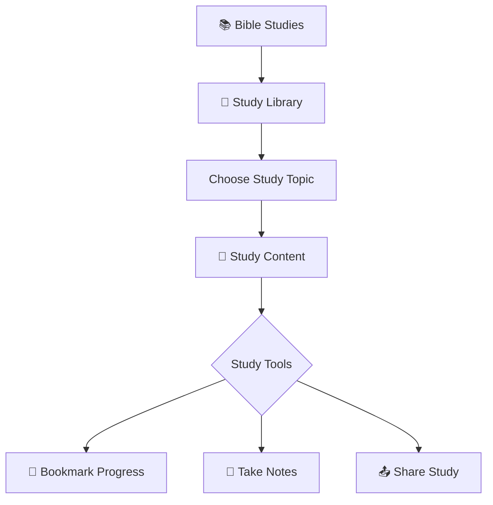
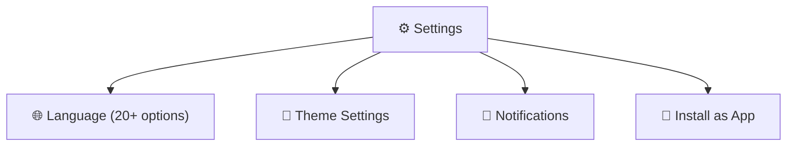
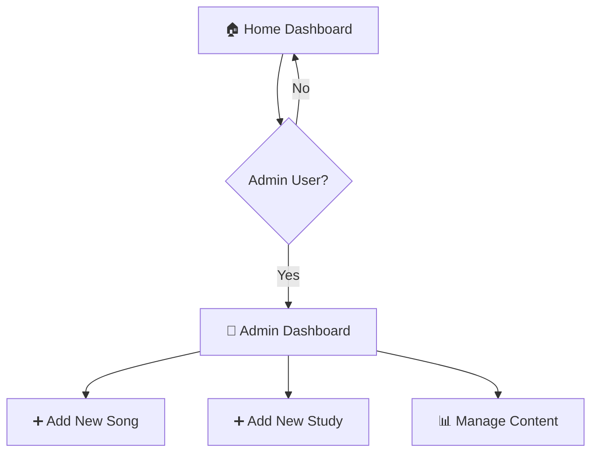
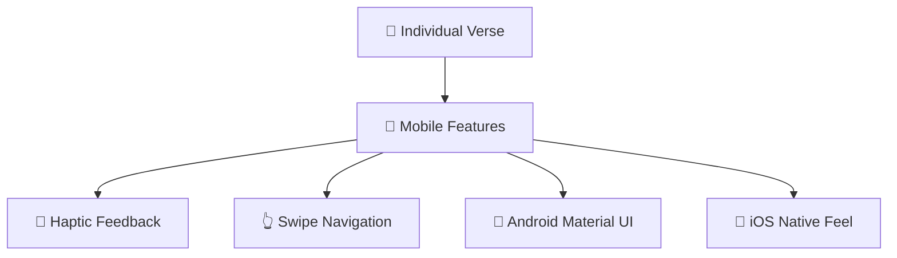

### TMS Companion App

**Project Purpose:**  
The TMS Companion App is designed to make memorization and study in the Topical Memorization Series (TMS) easier, accessible, and portable. Whether you’re on **mobile, PC, or tablet**, the app ensures you can stay consistent in your journey anytime and anywhere.

**Key Features:**

- Topical Memorization Series (A–E)
- Lyrics Catalog for plenary and group activities
- Plenary Guides & Illustrations
- GRID Series verses from the GRID books
- Multi-language support (Kenyan dialects + international)
- Optimized for **mobile-first use** with responsive design

**Cross-Platform:**  
Built as a **progressive web app (PWA)**, the TMS Companion runs seamlessly on mobile, tablet, and desktop. You can install it on your phone just like a native app.

**Link to Project:**  
[Visit TMS Companion App](https://tms-companion.netlify.app)

---

  

    
  

  

    
  

    

    
  

    

    
  

    

    
  

    
  

    
  

  Mobile-first experience — installable and fully responsive.

  

    
  

  Structured memorization through the Topical Memorization Series (A–E).

  

    
  

  Access a catalog of songs used during plenary and group activities.

  

    
  

  Visual guides and tools to support plenary sessions and sharing.

  

    
  

  Dedicated support for GRID series verses from the GRID books.

  

    
  

  Support for Kenyan dialects and international languages.

App Entry & Home Navigation

Verse Browsing & Interaction Flow

Song Library Flow

Study Flow

Settings & App Capabilities

Admin

Mobile Settings

